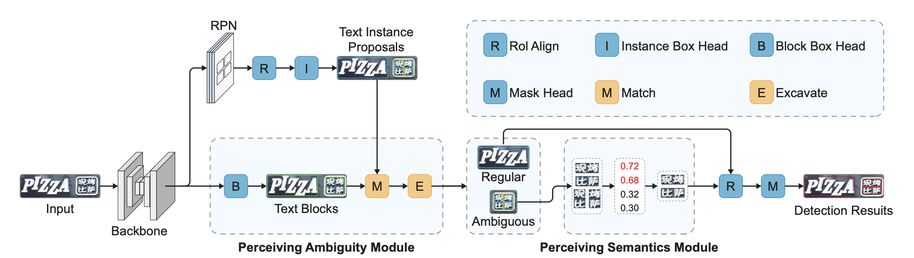

   
  
# Perceiving Ambiguity and Semantics without Recognition: An Efficient and Effective Ambiguous Scene Text Detector

This repository is the official implementation of [Perceiving Ambiguity and Semantics without Recognition: An Efficient and Effective Ambiguous Scene Text Detector](https://dl.acm.org/doi/10.1145/3581783.3612383).

Ambiguous scene text detection is an extremely challenging task. Existing text detectors that rely solely on visual cues often suffer from confusion due to being evenly distributed in rows/columns or incomplete detection owing to large character spacing. To overcome these challenges, the previous method recognizes a large number of proposals and utilizes semantic information predicted from recognition results to eliminate ambiguity. However, this method is inefficient, which limits their practical applications. In this paper, we propose a novel efficient and effective ambiguous text detector, which can Perceive Ambiguity and SEmantics without Recognition, termed PASER. On the one hand, PASER can perceive semantics without recognition with a light Perceiving Semantics (PerSem) module. In this way, proposals without reasonable semantics are filtered out, which largely speeds up the overall detection process. On the other hand, to detect both ambiguous and regular texts with a unified framework, PASER employs a Perceiving Ambiguity (PerAmb) module to distinguish ambiguous texts and regular texts, so that only the ambiguous proposals will be processed by PerSem while the regular texts are not, which further ensures the high efficiency. Extensive experiments show that our detector achieves state-of-the-art results on both ambiguous and regular scene text detection benchmarks. Notably, over 6 times faster speed and superior accuracy are achieved on TDA-ReCTS simultaneously.

 
<figcaption align="center">
The overview of PASER, which consists of a Perceiving Semantics (PerSem) module to predict semantics
without recognition and a Perceiving Ambiguity (PerAmb) module to distinguish ambiguous texts and regular texts.
</figcaption>

## Reference
For technical details and full experimental results, please check [our paper](https://dl.acm.org/doi/10.1145/3581783.3612383).

